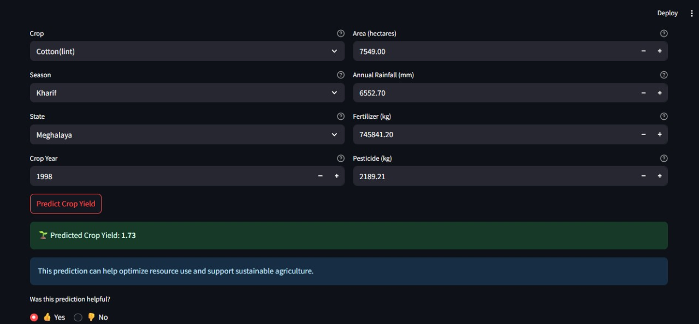
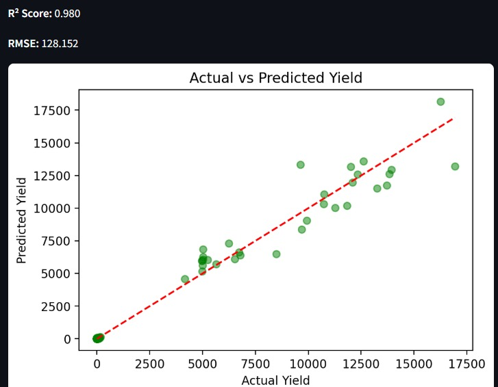

# 🌾 Crop Yield Predictor

Predict crop yields using machine learning and interactive web technology for smarter, sustainable agriculture.

---

## 🚀 Project Overview

The **Crop Yield Predictor** is a Streamlit web application that leverages machine learning to forecast crop yields based on agricultural and environmental data. Designed for farmers, agronomists, and researchers, this tool provides instant predictions and insights to optimize resource use and support sustainable farming practices.

---

## Snapshots



---

## 📊 Features

- **Interactive Web App:** User-friendly interface built with Streamlit.
- **Machine Learning Model:** Utilizes a Random Forest Regressor for robust yield prediction.
- **Feature Importance:** Visualizes which factors most influence crop yield.
- **Custom Input:** Predict yields for any crop, year, state, and input conditions.
- **Performance Metrics:** View R² score, RMSE, and actual vs. predicted plots.
- **Feedback System:** Users can provide feedback on prediction helpfulness.

---

## 🗂️ Dataset

- **Source:** `archive/crop_yield.csv`
- **Features:**
  - `Crop`: Name of the crop
  - `Crop_Year`: Year of cultivation
  - `Season`: Season of cultivation
  - `State`: State in India
  - `Area`: Area under cultivation (hectares)
  - `Annual_Rainfall`: Rainfall in mm
  - `Fertilizer`: Fertilizer used (kg)
  - `Pesticide`: Pesticide used (kg)
  - `Yield`: Crop yield (target variable)

---

## 🛠️ How It Works

1. **Data Loading & Preprocessing:**
   - Cleans and encodes categorical features.
2. **Model Training:**
   - Trains a Random Forest model with scaling and label encoding.
3. **Prediction:**
   - Users input crop details; the model predicts expected yield.
4. **Visualization:**
   - Shows feature importance and actual vs. predicted yield plots.

---

## 💻 Getting Started

### 1. Clone the Repository
```bash
git clone https://github.com/Atharvadethe/Edunet_final_proj.git
cd Edunet_final_proj/FInal_proj
```

### 2. Install Requirements
```bash
pip install -r requirements.txt
```

### 3. Run the App
```bash
streamlit run final.py
```

---

## 🤝 Contributing

Contributions are welcome! Please open issues or submit pull requests for improvements.

---

## 📄 License

This project is licensed under the MIT License.

---

## 🙏 Acknowledgements

- [Streamlit](https://streamlit.io/)
- [scikit-learn](https://scikit-learn.org/)
- [Pandas](https://pandas.pydata.org/)
- [Matplotlib](https://matplotlib.org/)

---

> Empowering agriculture with data-driven insights! 
